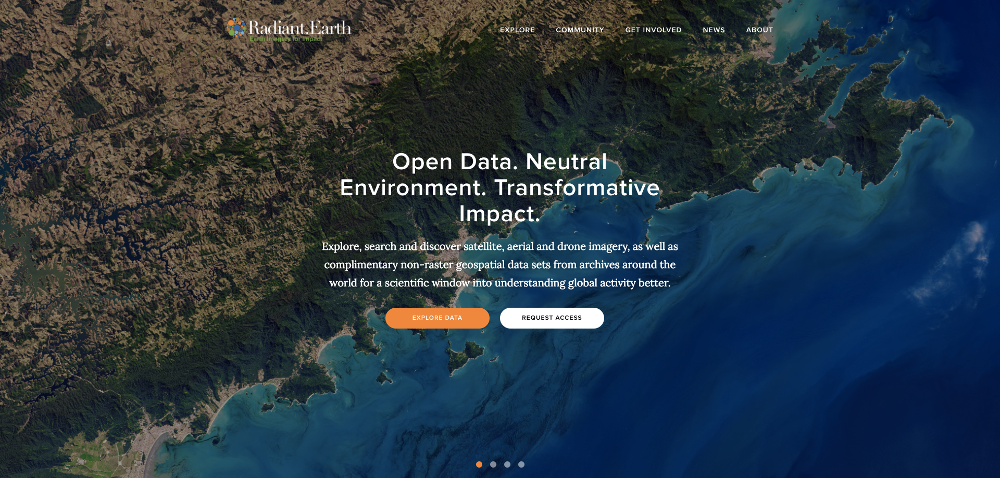

# What is Radiant-Earth project?

Radiant-Earth is a new a geospatial and imagery technology platform to help people more easily use aerial imagery to deliver economic, environmental and social impact around the world.



This repository covers:
- The home page (an introduction to the platform and the wider initiative).
- Explore page.
- Community (disabled)
- Get Involved page.
- News page.
- About page.
- Staff page.

# Development set up

- Install dependencies:
```
npm install
```

- Start the development server:
```
npm start
```
- [http://localhost:3000/](http://localhost:3000/) enjoy! :heart:
